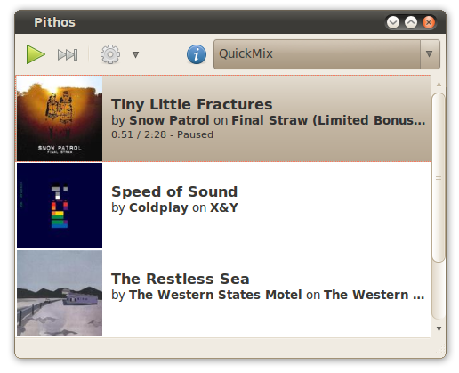

Pithos is a native [Pandora Radio](http://pandora.com) client for Linux. It's much more lightweight
than the Pandora.com web client, and integrates with desktop features such as media
keys, notifications, and the sound menu.

## Screenshot

You can find the Python source [on GitHub](https://github.com/kevinmehall/pithos) under the GPLv3.

## Links
&nbsp;

- [Changelog](changelog.html)
- [GitHub (source code)](https://github.com/pithos/pithos)
- [Bug reports](https://github.com/pithos/pithos/issues)

## Features

- Play / Pause / Next Song
- Switching stations
- Remembering user name and password
- Cover Art
- Thumbs Up / Thumbs Down / Tired of this song
- Notification popup with song info
- Launching pandora.com song info page and station page
- Reconnecting when pandora session times out
- Editing QuickMix
- Creating stations
- Media Key support
- Proxy support
- Last.fm scrobbling
  
### Not yet implemented

- Browsing genre stations
- Adding songs to stations / move song to another station

## Install
### Ubuntu (10.04, 11.04, 11.10, 12.04) PPA
    sudo add-apt-repository ppa:kevin-mehall/pithos-daily
    sudo apt-get update
    sudo apt-get install pithos
    
### Other Platforms (Building from source)

Note: remove any copies installed by a package manager before installing from source

**Dependencies:**  
  python2.6, python-xdg, python-gobject, python-gst0.10, python-notify, python-gtk2, python-dbus, gstreamer0.10-plugins-good, and gstreamer0.10-plugins-bad
  
**Build dependencies:**  
  python, python-central, python-distutils-extra
  
Debian and derivatives: 

    sudo apt-get install \
      python-distutils-extra python2.6 python-xdg python-dbus \
      python-gobject python-gst0.10 python-notify python-gtk2 \
      gstreamer0.10-plugins-good gstreamer0.10-plugins-bad git-core

Download, build, and install Pithos: 

	git clone https://github.com/kevinmehall/pithos.git
	cd pithos
	sudo python setup.py install --prefix=/usr/local

### Hacking
	
	git clone https://github.com/kevinmehall/pithos.git
	cd pithos
	./debug
  
## FAQ

### Why the name "Pithos"?

The original Pandora myth used the word ["pithos"](http://en.wikipedia.org/wiki/Pithos), which was mistranslated to "box". Similarly, a flash applet is a mistranslation to the Linux platform. 
 
### What does Pithos mean for Pandora?

Out of concern for the the longevity of Pandora Media Inc., I would recommend subscribing to Pandora One, or at the very least, clicking ads on [pandora.com](http://pandora.com). 

