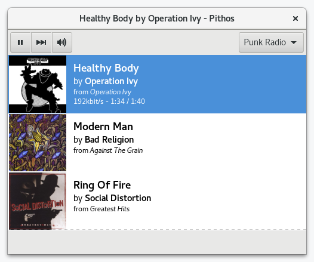

Pithos is a native [Pandora Radio](http://pandora.com) client for Linux. It's much more lightweight
than the Pandora.com web client, and integrates with desktop features such as media
keys, notifications, and the sound menu.

## News

**Pithos 1.5.1 released!** See the [changelog](https://github.com/pithos/pithos/releases/tag/1.5.1)
for details.

## Screenshot

## Links

- [Installation](#install)
- [Changelog](https://github.com/pithos/pithos/releases)
- [Source](https://github.com/pithos/pithos)
- [Source Downloads](https://github.com/pithos/pithos/releases)
- [Bug reports](https://github.com/pithos/pithos/issues)
- [Wiki](https://github.com/pithos/pithos/wiki)
- [IRC](ircs://chat.freenode.net/pithos)

## Features

- Play / Pause / Next Song
- Switching stations
- Remembering user name and password
- Cover Art
- Thumbs Up / Thumbs Down / Tired of this song
- Notification popup with song info
- Launching pandora.com song info page and station page
- Reconnecting when pandora session times out
- Editing QuickMix
- Creating stations
- Media Key support
- Proxy support
- Last.fm scrobbling

## <a name="install">Install</a>

### Installing with [Flatpak](https://flatpak.org/getting.html)

Flatpak is a cross distro format and is the only package supported by us.

    flatpak remote-add flathub https://flathub.org/repo/flathub.flatpakrepo
    flatpak install flathub io.github.Pithos

### Installing from source

Please read the [wiki](https://github.com/pithos/pithos/wiki/Installing-from-Source)
for information on installing from source.
  
## FAQ

### Why the name "Pithos?"

The original Pandora myth used the word "[pithos](http://en.wikipedia.org/wiki/Pithos),"
which was mistranslated to "box." Similarly, a flash applet is a
mistranslation to the Linux platform.
 
### What does Pithos mean for Pandora?

To support Pandora Media Inc. and enjoy higher quality audio, we recommend
subscribing to [Pandora One](http://pandora.com/one).
